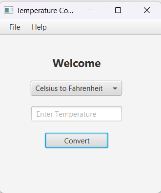

# 🔰TEMPERATURE_TO_FERHNHEIT-CONVERTER TOOL🎰

* This is a temperature converter tool created using JavaFX. The tool allows you to convert temperatures from Celsius to Fahrenheit and vice versa.

## ➡️SCREENSHOT

;

## ➡️HOW TO USE

* To use the tool, simply enter a temperature in Celsius or Fahrenheit in the corresponding text field. Then, click the "Convert" button to see the converted temperature in the other unit.

* You can also use the "Clear" button to reset the tool and enter a new temperature.

## ➡️ACKNOWLEDGEMENT
* This tool was created using JavaFX, SceneBuilder and the IntelliJ IDEA IDE.

## :v: ***Contributions are welcome! Feel free to submit pull requests or open issue and don't forget to give STAR🌟:!!***:relaxed:
